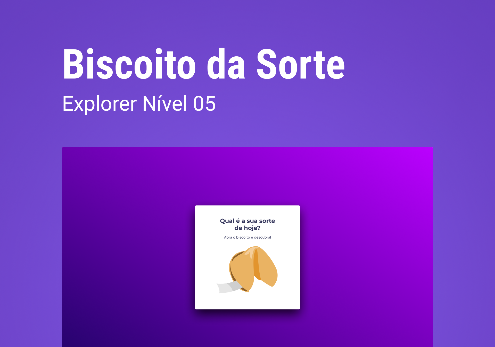

🇧🇷
## 💻 PROJETO
Neste desafio você deverá criar um jogo chamado Biscoito da Sorte, no qual o usuário, **a partir de um clique ou enter**, abre um biscoito com a sua sorte do dia. Você aplicará o que aprendeu sobre vários temas, entre eles:

- Estrutura de dados HTML
- Animações com CSS
- Funções no Javascript
- Manipulação da DOM
- Biblioteca JS Math()
- Funções *callback*
- Arrays

## 🚀 TECNOLOGIAS
Este projeto foi desenvolvido utilizando as seguintes tecnologias:
- HTML
- CSS
- GitHub
- Figma

## 🖌 LAYOUT
Você pode conferir o layout original [clicando aqui](https://www.figma.com/community/file/1182751789348533739).